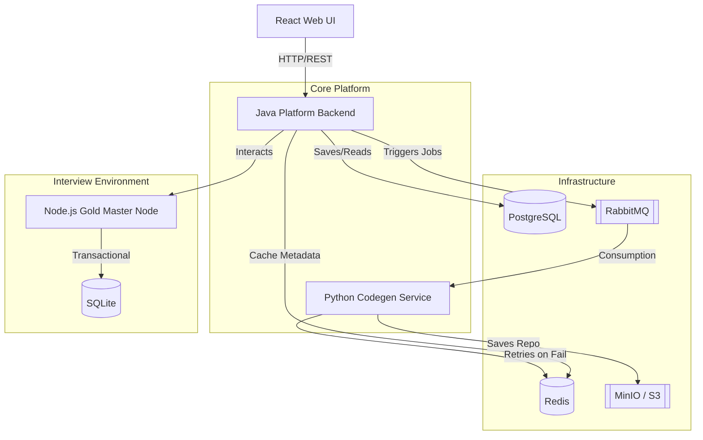

# High-Level Architecture

This document describes the architectural design of the Scalable Challenge Platform, focusing on its microservices, data flow, and resilience patterns.

## System Diagram

---

## Core Components

### 1. Platform Backend (Java / Spring Boot)
The central orchestration layer. It handles user authentication, challenge management, and submission tracking.
- **Data Store:** PostgreSQL (Relational data).
- **Communication:** Publishes tasks to RabbitMQ to decouple long-running operations.
- **Resilience:** Uses `spring-retry` for exponential backoff on transient database and message broker connection errors.

### 2. Python Codegen Service (FastAPI)
A specialized service for generating challenge environments.
- **Logic:** Transforms "Gold Master" repositories into candidate-ready "Starter" and "Solution" zips.
- **Cache:** Redis is used to store generated hashes to avoid redundant compute.
- **Resilience:** Implements `tenacity` decorators to gracefully handle Redis unavailability.

### 3. Gold Master Node (Node.js / Fastify)
A reference implementation for challenge applications.
- **Isolation:** Each challenge instance uses its own SQLite database to ensure data privacy and environment isolation.
- **Resilience:** Uses `async-retry` for database transactions to handle `SQLITE_BUSY` errors during high-concurrency periods.

### 4. Platform UI (React)
A high-fidelity IDE experience in the browser.
- **Technology:** Leverages WebContainers to run real Node.js environments directly in the candidate's browser without needing a remote backend for terminal/preview logic.

---

## Data Flow
1. **Challenge Creation:** Admin defines a challenge via the UI. Backend stores metadata in PostgreSQL.
2. **Environment Generation:** Backend sends a job to RabbitMQ. Codegen service consumes it, generates assets, and uploads them to S3/MinIO.
3. **Candidate Session:** Candidate loads the UI. The UI pulls challenge assets from S3 and boots them into a local WebContainer.
4. **Submission:** Candidate submits code. Backend stores the submission and triggers a grading workflow.

---

## Infrastructure Strategy
- **Managed Services (Production):** AWS RDS (Postgres), Amazon MQ (RabbitMQ), ElastiCache (Redis), and S3 (Storage).
- **Local Development:** Orchestrated via `docker-compose.yml` using Alpine-based container images.
