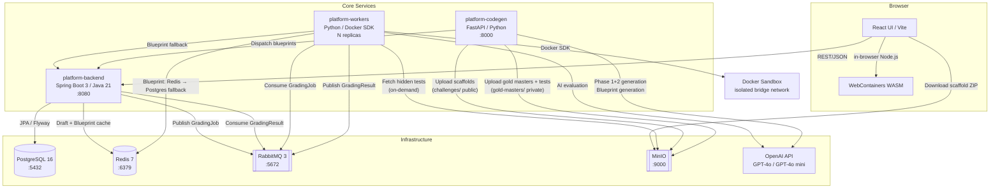

# Architecture Documentation

This document describes the architectural design of the Scalable Challenge Platform, including its microservices, data flows, storage model, and AI evaluation pipeline.

---

## System Overview



---

## Core Architectural Pillars

### 1. Tiered Challenge Architecture

Each challenge has **three structurally distinct codebases** — not three difficulty variants of the same code, but three separate implementations of the same business domain:

| Tier | Target | Files | Architecture | Strip Target |
|---|---|---|---|---|
| **Easy** | SDE1 / SDE2 | 2–3 | Flat, no service layer, heavy JSDoc | One function body (10–30 lines) |
| **Medium** | SDE2 / SDE3 | 5–7 | Controller-Service-DB, layered | One service method body (30–80 lines) |
| **Advanced** | SDE3 / Staff / Principal | 8–12 | Enterprise: Redis cache, mutex, circuit breakers | A concurrency/performance mechanism (50–150 lines) |

Each tier is stored separately in both the filesystem and MinIO. A student selecting `book-my-show-easy` gets a 2-file codebase appropriate for SDE1 — not an enterprise app with one line removed.

### 2. Volume-Independent Grading

Hidden test files are stored in MinIO `gold-masters/` and fetched **on-demand at grading time**. Workers cache fetched tests in process memory (per-process LRU). A wiped Docker volume does not break the grading pipeline — the authoritative copy is always MinIO.

The `challenges/` bucket (public, student scaffolds) is separate from `gold-masters/` (private, admin + workers only):

```
MinIO
├── challenges/       (anonymous download — students)
│   └── node/
│       ├── book-my-show-easy.zip      ← stripped scaffold
│       ├── book-my-show-medium.zip
│       └── book-my-show-advanced.zip
└── gold-masters/     (no anonymous access — admin + workers only)
    └── node/
        ├── book-my-show-easy.zip      ← src/ + test-hidden/ bundled
        ├── book-my-show-medium.zip
        └── book-my-show-advanced.zip
```

Each `gold-masters/` ZIP contains two directories: `src/` (reference implementation) and `test-hidden/` (grading tests).

### 3. Two-Phase AI Challenge Generation

Challenge creation uses a Chain-of-Thought pipeline:

```
POST /admin/generate-golden-repo  {prompt, language}
         │
         ▼
  Phase 1 — GPT-4o (design_challenge.mdx)
         │
         │  → DesignOutput:
         │    difficulty_tiers: { easy: {...}, medium: {...}, advanced: {...} }
         │    Each tier: scenario_tag, architecture description, strip_description
         │
         ▼
  Phase 2 × 3 — GPT-4o per tier (implement_gold_master_{lang}.mdx)
         │
         │  → SingleTierOutput per call:
         │    files: { complete gold master file tree for this tier }
         │    test_hidden: one complete hidden test file
         │    scenario_tag / title / description
         │
         ▼
  For each tier:
    ├── Write to /challenges/{name}/apps/gold-master-{tier}-{lang}/
    ├── engine.generate() strips @strip-target blocks → scaffold ZIP
    ├── Upload scaffold ZIP → MinIO challenges/ (public)
    └── Upload gold master ZIP → MinIO gold-masters/ (private)
         │
         ▼
  Blueprint generation per scenario — GPT-4o (generate_blueprint.mdx)
         │
         │  System message: gold master source (static, OpenAI prefix-cached)
         │  User message: scenario_tag + description (tiny, dynamic)
         │
         │  → Blueprint JSON:
         │    task: { description, constraints, expectedComplexity }
         │    repo: { relevantFiles, targetFile, goldMasterSource }
         │    evaluation: { senioritySignals, commonMistakes, rubric }
         │    followUpContext
         │
         ▼
  POST /api/admin/blueprints
    → Postgres blueprints table (JSONB, with goldMasterSource)
    → Redis blueprint:{challengeId} (24hr TTL)
```

**Cost:** ~$0.28 per challenge (3 Phase 2 calls). One-time admin operation.

### 4. Blueprint-Grounded AI Evaluation

Workers receive the full blueprint (including `goldMasterSource` and `rubric`) as the LLM system prompt. This enables:

- **Reference comparison:** GPT-4o mini compares the student's code to the correct implementation
- **Rubric anchoring:** Scores are anchored to observable behaviors (prevents score drift across students)
- **Seniority signals:** Specific observations from the design phase tell the evaluator what to look for
- **Test failure context:** Exact test failure messages from the Docker executor are included in the user message

**Prefix caching:** The system prompt (blueprint + goldMasterSource + rubric) is static per challenge scenario. OpenAI caches matching prefixes > 1024 tokens — first student pays full cost (~$0.002), subsequent students get ~50% discount (~$0.001).

### 5. Interview Sessions (B2B Mode)

The platform supports two modes:

| Mode | `userType` | Feedback style | Additional output |
|---|---|---|---|
| **Prep** (B2C) | `B2C` | Coaching: blind spots, learning opportunities | None |
| **Interview** (B2B) | `B2B` | Seniority assessment: production readiness | `hiring` object |

B2B hiring assessment structure:
```json
{
  "hiring": {
    "recommendation": "STRONG_YES | YES | LEAN_YES | LEAN_NO | NO",
    "confidence": "HIGH | MEDIUM | LOW",
    "strengths": ["Identified root cause immediately", "..."],
    "concerns": ["No transaction around multi-step write", "..."],
    "panelQuestions": ["How would this behave with 100 concurrent cancels?", "..."]
  }
}
```

Interview sessions group submissions from one candidate across multiple challenges, enabling post-interview debrief via `GET /api/admin/sessions/{id}/report`.

### 6. Asynchronous Grading Pipeline

```
Student submits
      │ POST /api/main/submit
      ▼
platform-backend
  ├── INSERT submissions (status=PENDING, attempt_number=count+1)
  └── Publish GradingJob → RabbitMQ grading-queue
              │
              ▼
platform-workers (consumer.py)
  │
  ├── Extract (base_id, tier) from challengeId
  │     "book-my-show-easy" → ("book-my-show", "easy")
  │
  ├── Blueprint: Redis.get() → 404 → GET /api/admin/blueprints/{id} → re-warm Redis
  │
  ├── Hidden tests: GoldMasterStorage.get_hidden_tests(base_id, tier, lang)
  │     MinIO gold-masters/{lang}/{base_id}-{tier}.zip → extract test-hidden/ → memory cache
  │
  ├── Stage: write files + inject hidden tests → /tmp/grading_stages/{uuid}/
  │
  ├── DockerExecutor.execute()
  │     ├── platform/node-executor (baked node_modules, 200 pids, 256m, 30s)
  │     ├── platform/python-executor (baked venv, 50 pids, 256m, 30s)
  │     └── openjdk:17-jdk-slim (Maven cache, 50 pids, 512m, 45s)
  │     All containers: isolated internal bridge network (loopback only, no internet)
  │
  ├── Publish initial result → results-queue  (immediate feedback)
  │
  └── If isPremium + success: LLMEvaluator.evaluate()
        System: blueprint + goldMasterSource + rubric + seniority signals (STATIC, cached)
        User:   filtered submission + test failure details (DYNAMIC, per submission)
        → GPT-4o mini → {correctness, efficiency, followUp, summary, [hiring if B2B]}
        → Semantic cache (SHA256 of submission, 24hr TTL)
        → Publish enriched result → results-queue

platform-backend (GradingResultListener)
  └── UPDATE submissions SET status=COMPLETED, feedback=..., score=...

Student polls / WebSocket
  └── GET /api/main/submissions/{id} → feedback displayed
```

### 7. Multi-Tenant User Isolation

- Drafts keyed by `{userId}:{challengeId}` in Redis + Postgres — no cross-user leakage
- `goldMasterSource` is **never** returned in student-facing API responses (`MainController`)
- `GET /api/main/challenges/{id}` strips the `repo.goldMasterSource` field from blueprint responses

### 8. Resilience

| Service | Pattern | Standard |
|---|---|---|
| **Java (Backend)** | `spring-retry` | 3 attempts, exponential backoff, initial 1s, multiplier 2.0 |
| **Python (Codegen, Workers)** | `tenacity` | `stop_after_attempt(3)`, `wait_exponential` |
| **Workers → MinIO** | Graceful degradation | On MinIO miss, grades without hidden tests (logs warning) |
| **Workers → Redis miss** | Postgres fallback | Re-fetches blueprint from Backend, re-warms Redis |

---

## Service Breakdown

### platform-backend (Java 21 / Spring Boot 3)

Central orchestrator handling authentication, submissions, blueprints, and interview sessions.

**Key components:**
- `AdminController` — blueprint storage, session management, gold master restore endpoint
- `MainController` — student-facing challenge/submission APIs (strips `goldMasterSource`)
- `SubmissionService` — auto-increments `attempt_number`, dispatches to RabbitMQ
- `GradingResultListener` — consumes results queue, updates submissions
- `BlueprintService` — Redis + Postgres blueprint cache with 7-day TTL

**Flyway migrations:**

| Version | Description |
|---|---|
| V1 | Initial schema (users, challenges, submissions) |
| V2 | Seed data (book-my-show challenge) |
| V3 | Auth fields |
| V4 | Blueprints table (JSONB) |
| V5 | User premium flag |
| V6 | Interview sessions, `user_type`, `session_id` + `attempt_number` on submissions |

### platform-workers (Python)

Stateless grading workers — scale horizontally with `docker compose up --scale workers=N`.

**Key components:**
- `consumer.py` — RabbitMQ consumer, orchestrates the full grading pipeline
- `docker_executor.py` — Docker SDK, sandboxed containers per language
- `llm_evaluator.py` — GPT-4o mini evaluation with goldMasterSource + rubric
- `infrastructure/storage.py` — MinIO hidden test fetching (in-memory cached)
- `infrastructure/cache.py` — Redis blueprint + semantic cache

**Executor images (pre-built at compose startup):**
- `platform/node-executor:latest` — Node.js 20 + pre-installed `node_modules` from `challenges/`
- `platform/python-executor:latest` — Python 3.11 + pre-installed venv
- `openjdk:17-jdk-slim` — pulled at runtime; Maven repo cached in `platform_maven_cache` volume

### platform-codegen (Python / FastAPI)

AI-driven challenge content pipeline. Admin-only; not student-facing.

**Key components:**
- `scaffold_generator.py` — orchestrates Phase 1 + Phase 2 × 3 + MinIO uploads
- `blueprint.py` — per-scenario blueprint generation + `goldMasterSource` post-processing
- `llm.py` — OpenAI client with token counting, caching, correction loop
- `validators.py` — Pydantic models (`SingleTierOutput`, `DesignOutput`) + LLM output validation
- `generator/engine.py` — strip engine: reads gold master, applies `@strip-target` blocks, produces scaffold ZIP
- `infrastructure/storage.py` — MinIO client with `upload_gold_master()` for private bucket

**Prompts (in `prompts/`):**

| File | Phase | Purpose |
|---|---|---|
| `design_challenge.mdx` | Phase 1 | Design 3 separate tiered codebases |
| `implement_gold_master_node.mdx` | Phase 2 | Node.js gold master + hidden test (one tier per call) |
| `implement_gold_master_java.mdx` | Phase 2 | Java Spring Boot gold master + JUnit hidden test |
| `implement_gold_master_python.mdx` | Phase 2 | Python FastAPI gold master + pytest hidden test |
| `generate_blueprint.mdx` | Blueprint | Scenario blueprint with rubric + seniority signals |

### platform-ui (React / Vite)

Browser-native IDE using WebContainers.

- **WebContainers:** Real Node.js runtime in the browser (WASM) — `npm install` and test runs happen client-side
- **Workspace:** Monaco editor + resizable terminal + file explorer
- **Feedback:** Layered AI feedback panel (correctness / efficiency / follow-up / hiring assessment)
- **Auto-save:** Drafts synced to backend every 2 seconds, keyed by `userId:challengeId`

---

## Data Model

```
PostgreSQL
│
├── users
│   id (UUID), email, username, name, is_premium, user_type (B2C|B2B)
│
├── challenges
│   id (String: "book-my-show-easy"), title, difficulty, language, scaffold_url
│
├── blueprints
│   challenge_id (FK), blueprint_json (JSONB)
│   {
│     task: { description, constraints, expectedComplexity }
│     repo: { relevantFiles, targetFile, goldMasterSource: {file→code} }
│     evaluation: { senioritySignals, commonMistakes, rubric }
│     followUpContext
│   }
│   ⚠ goldMasterSource never exposed to students
│
├── submissions
│   id (UUID), user_id (FK), challenge_id (FK), session_id (FK, nullable)
│   attempt_number, status, score, logs, feedback (JSONB), created_at
│
├── interview_sessions
│   id (UUID), candidate_id (FK), interviewer_id (FK, nullable)
│   challenge_ids (JSONB), status (SCHEDULED|IN_PROGRESS|COMPLETED)
│   created_at, completed_at
│
└── challenge_drafts
    user_id (FK), challenge_id (FK), files (JSONB), updated_at

Redis (cache — TTL 24hr, Postgres fallback)
├── blueprint:{challengeId}   → blueprints.blueprint_json
├── draft:{userId}:{challengeId} → challenge_drafts.files
└── eval_cache:{challengeId}:{sha256(submission)} → feedback JSON

MinIO
├── challenges/{lang}/{challengeId}.zip   PUBLIC  — student scaffold (stripped)
└── gold-masters/{lang}/{name}-{tier}.zip PRIVATE — src/ + test-hidden/ bundled
```

---

## Cost Model

### Challenge Generation (one-time per challenge)

| Step | Model | Est. Cost |
|---|---|---|
| Phase 1 — Design | GPT-4o | ~$0.01 |
| Phase 2 × 3 — Implementation | GPT-4o | ~$0.25 |
| Blueprint × 3 (with prefix caching) | GPT-4o | ~$0.02 |
| **Total per challenge** | | **~$0.28** |

### Per Student Evaluation

| Context | Tokens | Cost (GPT-4o mini) |
|---|---|---|
| goldMasterSource (~2,000 tokens) | +2,000 input | +$0.0003 (cached after 1st student) |
| Test failure details | +200 input | +$0.00003 |
| Scoring rubric | +300 input | +$0.00005 |
| B2B hiring output | +100 output | +$0.00006 |
| **Total per premium evaluation** | ~5,000 | **~$0.0015** |

At scale: **$1.50 per 1,000 premium evaluations**. Semantic caching (Redis) eliminates repeat costs for identical submissions.
