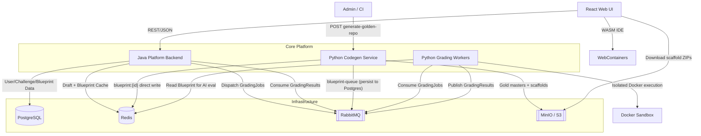

# Architecture Documentation

This document describes the architectural design of the Scalable Challenge Platform, covering its microservices, data flow, and browser-native execution model.

## System Diagram



---

## Core Architectural Pillars

### 1. Multi-Tenant User Isolation
The platform is designed with a strict user-scoped persistence model.
- **Draft Isolation:** Every user has their own private workspace state. Drafts are keyed by `{userId}:{challengeId}` in both Redis (fast access) and PostgreSQL (long-term storage).
- **Concurrent Safety:** Users can work on the same challenge simultaneously without data leakage.

### 2. Browser-Native Execution (WebContainers)
Unlike traditional platforms that rely on remote execution for IDE features, we leverage **WebContainers**.
- **WASM Node.js:** Runs a real Node.js environment directly in the browser.
- **WASM SQLite:** Challenges use `sql.js` for local storage, avoiding native C++ bindings unsupported in browser environments.
- **Efficiency:** Reduces server load by moving development-time execution (npm install, running tests) to the client side.

### 3. Asynchronous Isolated Grading
Final submissions are graded in a strictly controlled server-side environment.
- **JSON Transport:** Workspace files are sent as a flat JSON map (`Record<string, string>`) to minimize transport overhead.
- **Docker Sandboxing:** Python workers mount submitted files into ephemeral, network-disabled Docker containers for validation.
- **Reliability:** The flow is fully decoupled via **RabbitMQ**, ensuring the system handles large bursts of submissions without pressure on the backend.

### 4. AI-Powered Deep Evaluation
For premium users, the platform provides a three-layered AI evaluation after basic functional validation.
- **Layer 1 — Correctness:** Deep analysis of logic beyond simple test cases.
- **Layer 2 — Efficiency:** Analysis of time/space complexity and concurrency patterns.
- **Layer 3 — Interviewer Follow-up:** Persona-driven probes (Implementation or Conversational) based on the candidate's actual approach.
- **Cost Optimization:** Leverages **Anthropic Prompt Caching** for static problem blueprints and **Semantic Caching** in Redis to avoid redundant LLM calls for identical logic.

### 5. AI-Driven Challenge Generation
Challenge assets are generated entirely by a three-phase LLM pipeline, not hand-authored.
- **Phase 1 — Design:** A single GPT-4o call produces the full multi-tier, multi-scenario architecture document. Runs once per request regardless of how many languages are requested.
- **Phase 2 — Implementation:** Per-language skeleton generation (Phase 2a) followed by per-scenario function delta generation (Phase 2b). Supports Node.js, Java, and Python.
- **Phase 3 — Blueprints:** Per-scenario evaluation blueprints written to Redis (for immediate AI eval use) and published to RabbitMQ (for durable Postgres persistence via the backend).

---

## Service Breakdown

### Platform Backend (Java / Spring Boot 3)
The central orchestrator handling authentication, challenge metadata, submission routing, and result aggregation.
- **Blueprint Store:** Manages immutable "Problem Blueprints" (evaluation context) stored in Postgres (JSONB) and cached in Redis (`blueprint:{problemId}`, 7-day TTL).
- **Grading Router:** Dispatches `GradingJob` messages to RabbitMQ and consumes `GradingResult` messages to update submission state.
- **Resilience:** `spring-retry` with 3 attempts and exponential backoff (initial 1s, multiplier 2.0) on DB and broker connections.
- **Persistence:** PostgreSQL for relational data; Flyway for versioned schema migrations.

### Platform Codegen Service (Python / FastAPI)
Stateless AI generation service for producing all challenge assets from a natural language prompt.
- **Three-Phase CoT Pipeline:** Design → Skeleton → Deltas. See [platform-codegen/README.md](platform-codegen/README.md) for the full generation flow.
- **Multi-Language:** Generates parallel challenge assets for Node.js, Java, and Python from a single design phase.
- **Scenario Types:** `implement` (stub functions) and `debug` (intentionally broken code for debugging challenges).
- **Blueprint Dispatch:** Writes blueprints directly to Redis (critical path — AI eval reads from here) and publishes to `blueprint-queue` on RabbitMQ (backend persists to Postgres when available).
- **Resilience:** Tenacity retry (3 attempts, exponential backoff) on Redis and RabbitMQ operations.

### Python Grading Workers
Stateless workers responsible for executing candidate code and performing AI analysis.
- **Dual Pipeline:** Docker Executor (functional correctness) → LLM Evaluator (AI feedback, premium only).
- **LLM Evaluator:** Reads blueprint from Redis (`blueprint:{problemId}`), checks semantic cache, calls Anthropic Claude Haiku for structured feedback.
- **Communication:** Consumes from `grading-queue`, publishes to `grading-results-queue` via RabbitMQ.

### Platform UI (React / Vite)
The "CodeForge" IDE — browser-native code editing and testing environment.
- **AI Feedback UI:** Renders layered evaluation results and interviewer follow-ups in a dedicated feedback tab.
- **Features:** Resizable split-pane layout, markdown rendering for problem statements, real-time terminal streaming.

---

## Data Flow

### Challenge Generation (Admin / Offline)
```
Admin → POST /admin/generate-golden-repo
  ↓
Codegen: Phase 1 (Design) → Phase 2 (Skeleton + Deltas, per language)
  ↓
Upload gold masters + scaffolds → MinIO
  ↓
Write blueprints → Redis (direct) + RabbitMQ blueprint-queue (→ Backend → Postgres)
```

### Candidate Submission (Real-time)
```
1. Boot      UI fetches challenge metadata from Backend; downloads scaffold ZIP from MinIO
2. Mount     ZIP content unzipped, WASM-patched, mounted into WebContainer
3. Work      User code auto-saved every 2s to Backend (Redis + Postgres draft)
4. Execute   npm install / pytest runs in WebContainer (client-side, zero server load)
5. Submit    UI sends final file map to Backend
6. Grade     Backend fetches Blueprint, dispatches GradingJob → RabbitMQ grading-queue
7. Execute   Worker runs code in Docker sandbox (network-disabled)
8. Evaluate  (Premium) Worker reads Blueprint from Redis, checks semantic cache, calls LLM
9. Result    Worker publishes GradingResult → RabbitMQ → Backend → UI
```

---

## Storage Layout (MinIO)

| Bucket | Key Pattern | Visibility | Contents |
|---|---|---|---|
| `challenges` | `{lang}/{name}-{scenario}.zip` | Public | Student scaffold ZIPs |
| `gold-masters` | `{lang}/{name}-{tier}.zip` | Private | Gold master source + hidden tests |

---

## Service Communication

| From | To | Transport | Pattern |
|---|---|---|---|
| Backend | Workers | RabbitMQ `grading-queue` | Async job dispatch |
| Workers | Backend | RabbitMQ `grading-results-queue` | Async result publish |
| Codegen | Redis | Direct write | Blueprint cache (critical path) |
| Codegen | Backend | RabbitMQ `blueprint-queue` | Blueprint persistence (durable) |
| UI | Backend | REST/JSON | HTTPS |
| UI | MinIO | HTTP | ZIP download |
