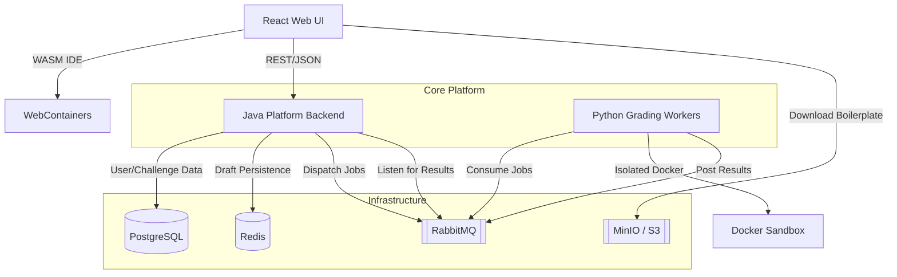

# Architecture Documentation

This document describes the architectural design of the Scalable Challenge Platform, focusing on its microservices, data flow, and browser-native execution model.

## System Diagram

---

## Core Architectural Pillars

### 1. Multi-Tenant User Isolation
The platform is designed with a strict user-scoped persistence model.
*   **Draft Isolation:** Every user has their own private workspace state. Drafts are keyed by `{userId}:{challengeId}` in both Redis (for fast access) and PostgreSQL (for long-term storage).
*   **Concurrent Safety:** Users can work on the same challenge simultaneously without data leakage.

### 2. Browser-Native Execution (WebContainers)
Unlike traditional platforms that rely on remote execution for IDE features, we leverage **WebContainers**.
*   **WASM Node.js:** Runs a real Node.js environment directly in the browser.
*   **WASM SQLite:** Challenges use `sql.js` for local storage, avoiding the need for native C++ bindings which are unsupported in browser environments.
*   **Efficiency:** Reduces server load by moving development-time execution (npm install, running tests) to the client side.

### 3. Asynchronous Isolated Grading
Final submissions are graded in a strictly controlled server-side environment.
*   **JSON Transport:** Workspace files are sent as a flat JSON map (`Record<string, string>`) to minimize transport overhead.
*   **Docker Sandboxing:** Python workers mount the submitted files into ephemeral, network-disabled Docker containers for validation.
*   **Reliability:** The flow is fully decoupled via **RabbitMQ**, ensuring the system can handle large bursts of submissions.

### 4. AI-Powered Deep Evaluation
For premium users, the platform provides a three-layered AI evaluation after basic functional validation.
*   **Layer 1: Correctness:** Deep analysis of the logic beyond simple test cases.
*   **Layer 2: Efficiency:** Analysis of time/space complexity and concurrency patterns.
*   **Layer 3: Interviewer Follow-up:** Persona-driven probes (Implementation or Conversational) based on the candidate's actual approach.
*   **Cost Optimization:** Leverages **Anthropic Prompt Caching** for static problem blueprints and **Semantic Caching** in Redis to avoid redundant LLM calls for identical logic.

---

## Service Breakdown

### Platform Backend (Java / Spring Boot)
The central orchestrator handling authentication, challenge metadata, and result aggregation.
- **Blueprint Store:** Manages immutable "Problem Blueprints" (metadata + evaluation context) stored in Postgres (JSONB) and cached in Redis.
- **Resilience:** Implements `spring-retry` for exponential backoff on database and broker connections.
- **Persistence:** PostgreSQL for relational data; Flyway for versioned migrations.

### Python Grading Workers
Stateless workers responsible for executing candidate code and performing AI analysis.
- **Dual Pipeline:** First executes code in an isolated **Docker Executor**, then (for premium users) performs AI analysis via the **LLM Evaluator**.
- **LLM Evaluator:** Communicates with Anthropic/OpenAI to generate structured feedback. Network-enabled but strictly separated from the Docker sandbox.
- **Communication:** Bi-directional RabbitMQ flow for job receipt and result publishing.

### Platform UI (React / Vite)
The modern "CodeForge" IDE.
- **AI Feedback UI:** Renders layered evaluation results and interviewer follow-ups in a dedicated feedback tab.
- **Features:** Resizable split-pane layout, markdown rendering for problem statements, and real-time terminal streaming.

---

## Data Flow (End-to-End)
1.  **Boot:** UI fetches challenge metadata from Backend and boilerplate ZIP from S3.
2.  **Mount:** ZIP content is unzipped, WASM-patched, and mounted into a WebContainer.
3.  **Work:** User code is auto-saved every 2 seconds to the Backend (Redis + Postgres).
4.  **Execute:** `npm install` runs in the background; user runs tests locally in the browser.
5.  **Submit:** UI sends the final file map to the Backend.
6.  **Grade:** 
    - Backend fetches the **Blueprint** context and queues a `GradingJob`.
    - Worker executes code in **Docker** (Isolation).
    - If Premium: Worker fetches Blueprint from Redis, checks **Semantic Cache**, and calls **LLM Evaluator** (Analysis).
    - Worker returns an enriched `GradingResult` with layered feedback.
