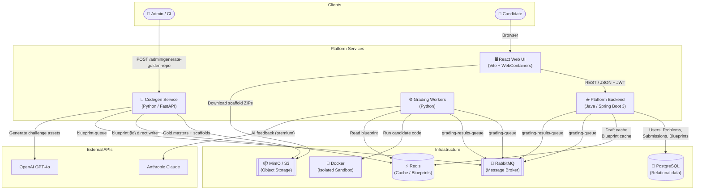
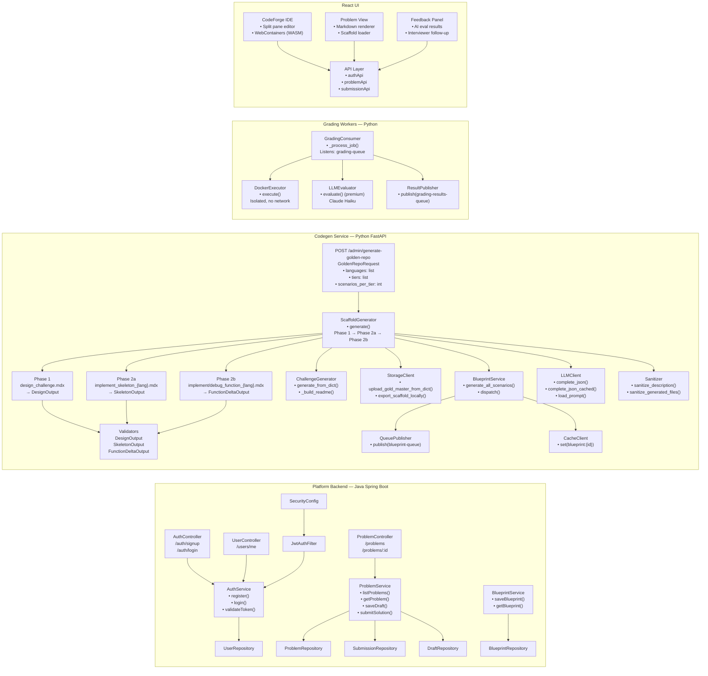
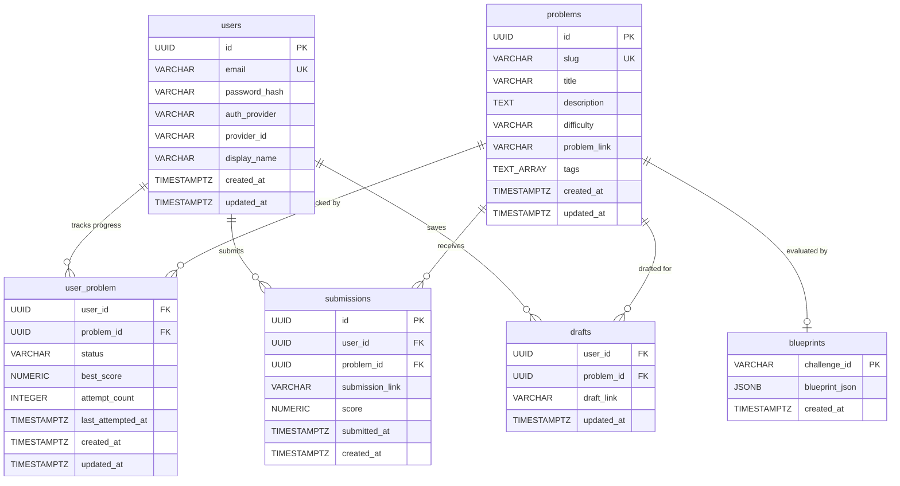
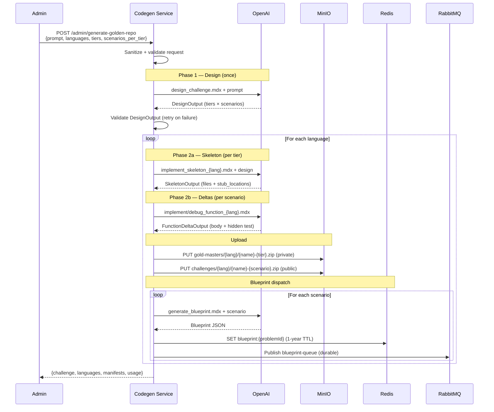
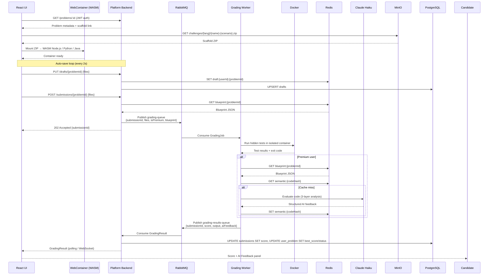
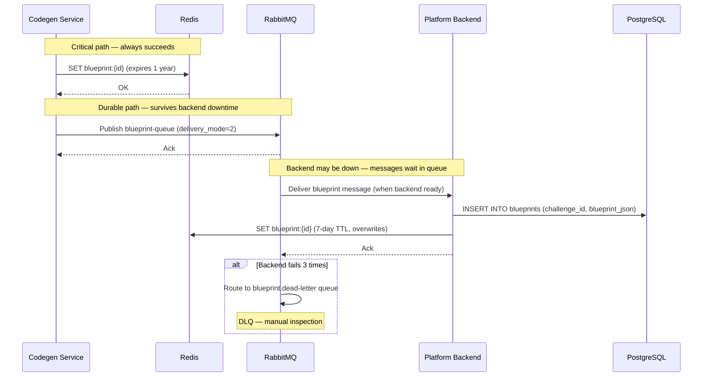

# Platform Diagrams

All diagrams use [Mermaid](https://mermaid.js.org/) syntax — rendered automatically on GitHub, GitLab, and Notion.

---

## 1. High-Level Design (HLD)

> 30,000-foot view of every service, infrastructure component, and the data paths between them.



---

## 2. Low-Level Design (LLD)

> Internal component breakdown of each service showing classes, APIs, and data contracts.



---

## 3. Entity Relationship Diagram (ERD)

> Database schema across PostgreSQL tables (Flyway-managed).



**Redis keys (non-relational):**

| Key Pattern | Value | TTL | Written by |
|---|---|---|---|
| `blueprint:{challengeId}` | Blueprint JSON | 1 year (codegen) / 7 days (backend) | Codegen direct write |
| `draft:{userId}:{problemId}` | Draft file map | Session | Backend |
| `semantic:{hash}` | LLM response | 24h | Workers |

---

## 4. Flow Diagram

### 4a — Challenge Generation Flow (Admin)

```mermaid
flowchart TD
    A([Admin sends POST /admin/generate-golden-repo]) --> B[Sanitize prompt]
    B --> C{Valid?}
    C -- No --> ERR1([HTTP 400 Bad Request])
    C -- Yes --> D

    D["Phase 1: design_challenge.mdx\nGPT-4o → DesignOutput\nOne design per tier × N scenarios"]
    D --> E{Validates?}
    E -- No, retry --> D
    E -- Yes --> F

    F["For each language in languages list"]
    F --> G

    subgraph "Phase 2a — Skeleton (per tier)"
        G["implement_skeleton_{lang}.mdx\nGPT-4o → SkeletonOutput\nFull codebase + stubs + per-scenario READMEs"]
        G --> H{Validates?}
        H -- No, retry → correction prompt --> G
        H -- Yes --> I[Store SkeletonOutput for tier]
    end

    I --> J

    subgraph "Phase 2b — Deltas (per scenario)"
        J["implement/debug_function_{lang}.mdx\nGPT-4o → FunctionDeltaOutput\nCorrect body + hidden test"]
        J --> K{Validates?}
        K -- No, retry --> J
        K -- Yes --> L[Store delta + test]
    end

    L --> M

    subgraph "Assembly + Upload"
        M["Inject all deltas → Gold Master\nSanitize files"]
        M --> N[Upload gold-masters/{lang}/{name}-{tier}.zip → MinIO private]
        M --> O[Generate scaffold ZIP per scenario\nstubs → TODO comments\nAdd scenario README]
        O --> P[Upload challenges/{lang}/{name}-{scenario}.zip → MinIO public]
        O --> Q[Export to /generated/{name}/{lang}/ — dev only]
    end

    P --> R

    subgraph "Phase 3 — Blueprints"
        R["generate_blueprint.mdx\nGPT-4o → Blueprint JSON\n+ embed goldMasterSource"]
        R --> S[Write blueprint:{id} → Redis\ndirect, unconditional]
        R --> T[Publish → RabbitMQ blueprint-queue\ndurable, survives backend restart]
    end

    S --> U([Return manifest + usage stats])
    T --> U
```

### 4b — Candidate Submission Flow

```mermaid
flowchart TD
    A([Candidate opens challenge]) --> B[UI fetches problem metadata\nfrom Backend]
    B --> C[Download scaffold ZIP\nfrom MinIO challenges/]
    C --> D[Unzip + mount into WebContainer\nWASM Node.js / Python / Java]
    D --> E[Candidate writes code in browser IDE]
    E --> F{Auto-save every 2s}
    F --> G[POST draft to Backend\nRedis + Postgres]
    G --> E

    E --> H([Candidate clicks Submit])
    H --> I[UI sends file map to Backend]
    I --> J[Backend fetches Blueprint\nfrom Redis blueprint:{id}]
    J --> K[Backend dispatches GradingJob\n→ RabbitMQ grading-queue]
    K --> L[Worker consumes GradingJob]

    L --> M[Docker Executor\nMount files into isolated container\nRun hidden tests]
    M --> N{Tests pass?}
    N -- Fail --> O[Score = 0–49\nReturn test output]
    N -- Pass --> P[Score = 50–100\nReturn test output]

    P --> Q{isPremium?}
    O --> Q

    Q -- No --> R[Publish GradingResult → grading-results-queue]
    Q -- Yes --> S[LLM Evaluator\nRead Blueprint from Redis\nCheck semantic cache]
    S --> T[Call Claude Haiku\nLayer 1: Correctness\nLayer 2: Efficiency\nLayer 3: Interviewer Follow-up]
    T --> R

    R --> U[Backend consumes result\nUpdate submission + user_problem]
    U --> V[Push result to UI via polling/WS]
    V --> W([Show score + AI feedback])
```

---

## 5. Swim Lane Diagram

### 5a — Challenge Generation (Admin → Codegen → Infrastructure)



### 5b — Candidate Submission (UI → Backend → Workers)



### 5c — Blueprint Persistence (Codegen → Backend, async)


