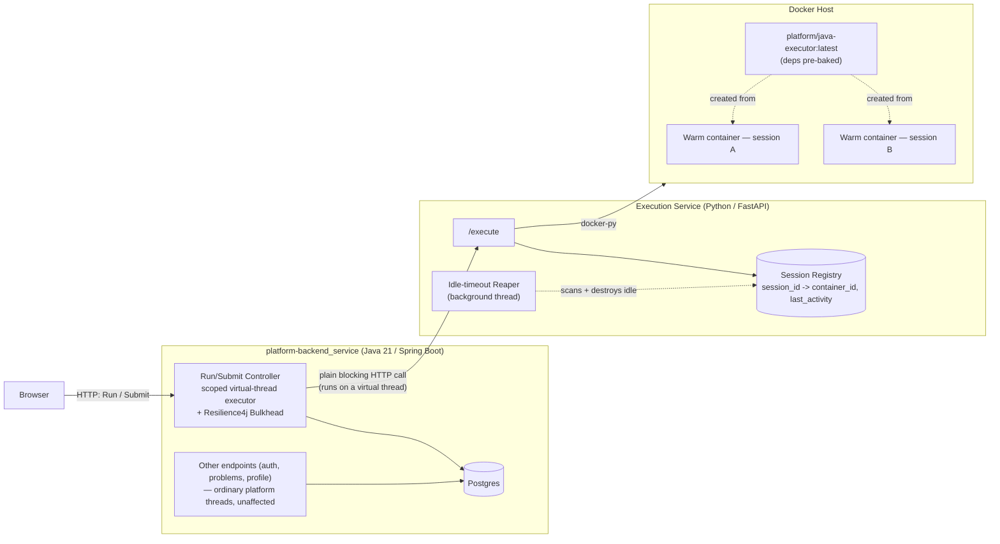

# Deferred Eager Execution — Final Architecture (Java/Spring Boot, v1)

**Status:** Approved direction for v1 implementation.
**Companions:** `repo-execution-architecture.md`, `execution-tradeoffs-and-timeout.md`,
`per-problem-pooled-provisioning.md` (lifecycle policy — *what* Deferred Eager is) and
`execution-service-architecture.md` (deep mechanics — *how* each mechanism works step by step).
This document is the condensed, implementation-ready summary of both: the final shape, why it
was chosen over the alternatives considered, and what to watch for as it's built and operated.

---

## 1. Context

The platform needs server-side container execution for challenge code (Run + Submit), replacing
the browser-only WebContainer model. The design docs settled on **Deferred Eager** as the
provisioning policy: a container is created on a session's first Run/Submit click, kept warm and
reused for that session until a ~10min idle timeout, then torn down — never shared across
concurrent users. This document settles the concrete *service topology* and *backend concurrency
model* needed to implement that policy, starting with Java/Spring Boot before extending to
Node/Python.

---

## 2. Final Architecture

### 2.1 Components

- **Backend (`platform-backend_service`, Java/Spring Boot, Java 21):** orchestrates only — never
  touches Docker. Handles auth, problem browsing, and the Run/Submit endpoints. The Run/Submit
  call path uses a scoped virtual-thread executor (§3); every other endpoint is unaffected,
  unchanged, running on Tomcat's ordinary platform-thread pool.
- **Execution Service (new, Python/FastAPI + `docker-py`):** the only component with Docker
  access. Owns the session→container registry, the idle-timeout reaper, and the actual
  create/reuse/exec/destroy lifecycle. Chosen over Java/`docker-java` and Go primarily for
  `docker-py`'s SDK maturity for this exact problem (see `execution-service-architecture.md` §2
  for the full options table).
- **Docker host:** runs containers built from `platform/java-executor:latest` — a pre-baked image
  with the base Spring Boot dependency tree already resolved via `mvn dependency:go-offline`
  (Task 1), so no network/install cost at execution time.
- **Postgres:** system of record for `problems`/`submissions`/session metadata (durable); the
  Execution Service's in-memory session registry is disposable by design (a restart is equivalent
  to an idle-timeout reap — not a correctness concern).

### 2.2 Component diagram



### 2.3 Run-flow sequence (cold start vs. warm reuse)

```mermaid
sequenceDiagram
    participant Browser
    participant Backend as Backend (virtual thread)
    participant Bulkhead as Resilience4j Bulkhead
    participant ExecSvc as Execution Service
    participant Registry as Session Registry
    participant Docker as Docker Host

    Browser->>Backend: POST /problems/{id}/run
    Backend->>Backend: validate + lookup/create session (JPA)
    Backend->>Bulkhead: acquire permit
    alt permit available
        Bulkhead->>ExecSvc: blocking call (virtual thread; carrier freed while waiting)
        ExecSvc->>Registry: lookup session_id
        alt warm container exists
            Registry-->>ExecSvc: container_id (warm)
            ExecSvc->>Docker: sync files + exec (reuse — fast path)
        else no warm container
            Registry-->>ExecSvc: not found
            ExecSvc->>Docker: create container from platform/java-executor:latest
            Docker-->>ExecSvc: container ready (cold-start cost paid here)
            ExecSvc->>Docker: sync files + exec
        end
        Docker-->>ExecSvc: stdout/stderr, exit code
        ExecSvc->>Registry: update last_activity
        ExecSvc-->>Backend: result
        Backend-->>Browser: response
    else permit exhausted (Execution Service at capacity)
        Bulkhead-->>Backend: reject
        Backend-->>Browser: 503 server busy
    end

    Note over Registry,Docker: Background reaper scans the registry on an interval;<br/>destroys containers idle > 10min (placeholder value)
```

---

## 3. Backend Concurrency Model: Scoped Virtual Threads + Bulkhead

### 3.1 The decision

The Run/Submit controllers use **`Executors.newVirtualThreadPerTaskExecutor()`** (JDK 21) to run
the blocking call to the Execution Service, gated by a **Resilience4j `Bulkhead`** (already a
stack dependency) sized to the Execution Service's real concurrent capacity. This is deliberately
*scoped* — not the global `spring.threads.virtual.enabled=true` switch. Every other endpoint
(auth, problem browsing, profile) is untouched, running on Tomcat's ordinary platform-thread pool
exactly as today.

Mechanically: the controller submits the blocking Execution-Service call as a task to the virtual-
thread executor and returns a `DeferredResult`/`CompletableFuture` immediately, releasing the
original Tomcat platform thread back to its pool (the same `startAsync()` trick used for any async
servlet dispatch — see `execution-service-architecture.md` §5.2 step 2 for the full mechanical
trace). The submitted task runs on a virtual thread, which parks cheaply during the blocking
HTTP wait and resumes when the Execution Service responds.

### 3.2 Why this over the alternatives considered

| Alternative | Why not |
|---|---|
| Reactive `WebClient` (`Mono`/`Flux`) | Solves the same thread-starvation problem, but requires reactive code throughout this path, and only fully pays off if the data layer also goes reactive (JPA → R2DBC) — a large, disruptive lift for endpoints that don't need it. |
| `SseEmitter` + a hand-sized dedicated platform-thread pool | Each concurrent active stream costs one real OS thread (~1MB stack); requires picking and tuning a pool-size ceiling by hand. Virtual threads get the same code simplicity at a fraction of the per-unit cost (see §4 below). |
| Global `spring.threads.virtual.enabled=true` | Works, but the `synchronized`-pinning audit surface (§5) becomes the *entire application* instead of one call path, and every endpoint's behavior changes at once — unnecessary risk for a JDK feature with limited production track record. |
| Async queue (RabbitMQ/Kafka) for Run | Rejected independently of the threading question — Deferred Eager's container affinity (a warm container lives on one specific Docker host) defeats the "any consumer can take any job" property that makes queues valuable; Kafka's stickier partition assignment still breaks on rebalance. Full reasoning in `execution-service-architecture.md` §3 and §6.4. |

### 3.3 Why this also fixes admission control "for free"

Virtual threads remove an *accidental* protection that today's bounded Tomcat thread pool
provides: once that pool is full, new requests queue/reject at the connector level *before* ever
reaching a downstream dependency. Removing the pool ceiling (via virtual threads) removes that
incidental protection — a traffic spike that used to get throttled at the backend's door would
otherwise sail straight through to the Execution Service. Scoping the executor explicitly gives a
natural point to add deliberate admission control: the `Bulkhead` wraps the submission point, so
excess concurrent calls are rejected (503) before they reach the Execution Service, restoring the
protection deliberately instead of accidentally.

---

## 4. Why Virtual Threads, With Numbers

(Full table in `execution-service-architecture.md` §6.5 — condensed here.)

| | Platform thread (per active stream) | Virtual thread | Reactor event loop |
|---|---|---|---|
| Memory per unit of concurrency | ~1MB fixed stack | A few hundred bytes, grows on heap | ~tens of KB per connection, no per-unit thread |
| Practical max concurrent units, one node | Low thousands before degradation (e.g. 5,000 × 1MB ≈ 5GB in stacks alone) | Demonstrated in the millions (JEP 444 benchmarks) | Tens of thousands of connections, bounded by memory/file descriptors not threads |
| Real OS threads needed | 1 per active unit | ≈ CPU core count, regardless of logical concurrency | ≈ CPU core count |
| Programming model | Plain blocking | Plain blocking (identical code to the platform-thread case) | Reactive (`Flux`/`Mono`) |
| Works unmodified with existing JPA/Resilience4j code | Yes | Yes | No — needs R2DBC for full benefit |

**The deciding factors for this codebase specifically:** already on JDK 21 (zero new
infrastructure beyond one executor + one Bulkhead); the existing/planned backend is full of
ordinary blocking calls (JPA, `@Retryable`) that benefit without any rewrite; strictly simpler
code and debugging than the reactive alternative (real stack traces, normal breakpoints); roughly
three orders of magnitude cheaper per unit of concurrency than the dedicated-thread-pool
alternative.

---

## 5. What To Watch Out For Going Forward

1. **`synchronized`-block pinning (JDK 21).** A virtual thread cannot unmount while inside a
   `synchronized` block or certain native calls — hitting this in the Run/Submit call path
   silently reintroduces platform-thread-style blocking, defeating the model in a way that's easy
   to miss in review. Mitigation: prefer `ReentrantLock` over `synchronized` in this path; use
   `-Djdk.tracePinnedThreads` in development to catch regressions. **This is an ongoing review
   discipline, not a one-time fix** — every future PR touching this path needs this check.
   Fixed upstream in JDK 24 (JEP 491) — revisit once the project upgrades past 21.
2. **`ThreadLocal`-heavy libraries.** Anything assuming "few, long-lived threads" (some
   logging/tracing/security-context-propagation patterns, e.g. Spring Security's default context
   strategy) should be checked under much higher thread-count churn before relying on it broadly.
3. **Bulkhead capacity needs a real number, not a guess.** It must be sized to the Execution
   Service's actual concurrent capacity (bounded by the Docker host's CPU/memory and how many
   JVMs/Maven processes it can run at once) — this is a "needs telemetry" item, the same shape as
   the idle-timeout value below.
4. **Tooling maturity.** Thread-dump-based diagnostics get unwieldy at very large virtual-thread
   counts; newer JDK tooling (`jcmd Thread.dump_to_file`) is still the right tool but less
   familiar than traditional thread-dump workflows.
5. **Virtual threads fix the backend's thread budget, not the real throughput ceiling.** The
   actual limit on concurrent Run/Submit throughput is the Execution Service/Docker host's CPU
   and memory. Horizontally scaling backend pods (e.g. on Kubernetes) does not change this ceiling
   — it only changes how much load can queue up in front of a still-single-capacity execution
   tier.
6. **Less production track record than thread pools or Reactor.** JDK 21 (2023) is comparatively
   new; fewer war stories and a smaller pool of engineers with hands-on Loom debugging experience
   than either alternative. Worth extra logging/observability around this path early on.

---

## 6. Open Decisions Not Yet Resolved

These don't block starting implementation but should be settled before this goes further than a
single-node, single-language (Java) v1:

1. **Submit path:** reuse the session's warm container (same affinity question as Run), or stay
   fully async/ephemeral as grading does today?
2. **Session registry persistence:** in-memory in the Execution Service (disposable, restart =
   idle-timeout reap) vs. Redis/Postgres-backed. Leaning in-memory for a single-node v1.
3. **Single execution node vs. multi-node session routing.** Single-node sidesteps the
   container-affinity routing problem entirely; multi-node needs a shared registry (e.g. Redis:
   session_id → node) from day one. Leaning single-node for v1, matching current scale and the
   design docs' own "don't build speculatively" stance.
4. **Idle-timeout value** — needs real telemetry; 10min is a placeholder.
5. **File sync mechanism** (editor → container): push-on-autosave vs. sync-at-Run-time. Not yet
   discussed.
6. **Bulkhead capacity sizing** — needs a real concurrent-capacity number for the Execution
   Service (see §5.3 above).

---

## 7. Next Steps (Implementation)

1. Finish the Java pre-baked image pipeline (executor image + `docker_executor.py` wiring) —
   already in progress.
2. Build the Execution Service's session lifecycle manager (registry, reuse, reaper).
3. Wire the Run/Submit controllers with the scoped virtual-thread executor + Bulkhead pattern
   from §3, and the supporting Flyway migration for session metadata.
4. Add a minimal Java/Spring Boot sample challenge to validate end-to-end.
5. End-to-end validation via `docker compose up --build`.
